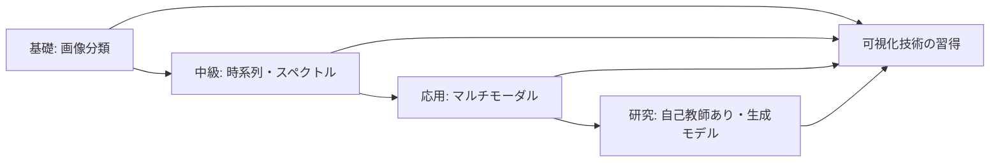

# Multimodal Universe

Multimodal Universe は、天文学の複数のサーベイやモダリティから収集された大規模なマルチモーダルデータセットのコレクションです。このプロジェクトは、機械学習や深層学習を用いた天文学研究を促進することを目的としています。

## データセット概要

| Survey | Modality | Science Use Case | # samples |
|--------|----------|-----------------|-----------|
| Legacy Surveys DR10 | Images | Galaxies | 124M |
| Legacy Surveys North | Images | Galaxies | 15M |
| HSC | Images | Galaxies | 477k |
| BTS | Images | Supernovae | 400k |
| JWST | Images | Galaxies | 300k |
| Gaia BP/RP | Spectra | Stars | 220M |
| SDSS-II | Spectra | Galaxies, Stars | 4M |
| DESI | Spectra | Galaxies | 20M |
| APOGEE SDSS-III | Spectra | Stars | 716k |
| GALAH | Spectra | Stars | 325k |
| Chandra | Spectra | Galaxies, Stars | 129k |
| VIPERS | Spectra | Galaxies | 91k |
| MaNGA SDSS-IV | Hyperspectral Image | Galaxies | 12k |
| PLAsTiCC | Time Series | Time-varying objects | 3.5M |
| TESS | Time Series | Exoplanets | 160k |
| CfA Sample | Time Series | Supernovae | 1k |
| YSE | Time Series | Supernovae | 2k |
| PS1 SNe Ia | Time Series | Supernovae | 369 |
| DES Y3 SNe Ia | Time Series | Supernovae | 248 |
| SNLS | Time Series | Supernovae | 239 |
| Foundation | Time Series | Supernovae | 180 |
| CSP SNe Ia | Time Series | Supernovae | 134 |
| Swift SNe Ia | Time Series | Supernovae | 117 |
| Gaia | Tabular | Stars | 220M |
| PROVABGS | Tabular | Galaxies | 221k |
| Galaxy10 DECaLS | Tabular | Galaxies | 15k |
| GALEX All-Sky Imaging | Tabular | Stars | 83M |
| SAGES DR1 | Tabular | Stars | 48.5M |
| 2MASS PSC | Tabular | Galaxies, Stars | 471M |
| AllWISE Source Catalog | Tabular | Galaxies, Stars | 747M |

## 画像データセット (Images)

### Legacy Surveys DR10 (124M samples)
Dark Energy Camera Legacy Survey (DECaLS) のデータリリース10。可視光域での広域銀河サーベイで、銀河の形態分類、赤方偏移推定、大規模構造の研究に使用されます。

### Legacy Surveys North (15M samples)
Legacy Surveys の北天領域のデータ。DECaLS の補完データとして、銀河の統計的研究や機械学習モデルの訓練に利用されます。

### HSC (Hyper Suprime-Cam) (477k samples)
すばる望遠鏡の超広視野カメラによる深い銀河画像。高赤方偏移銀河、弱重力レンズ効果、銀河進化の研究に最適です。

### BTS (Bright Transient Survey) (400k samples)
明るい突発天体（主に超新星）の画像データ。超新星の分類、光度曲線の解析、爆発メカニズムの理解に使用されます。

### JWST (James Webb Space Telescope) (300k samples)
ジェイムズ・ウェッブ宇宙望遠鏡による赤外線画像。初期宇宙の銀河、星形成領域、系外惑星大気の観測に革新的なデータを提供します。

## スペクトルデータセット (Spectra)

### Gaia BP/RP (220M samples)
Gaia 衛星のBlue Photometer/Red Photometer による低分解能スペクトル。恒星の分類、化学組成、物理パラメータの導出に使用されます。

### SDSS-II (Sloan Digital Sky Survey II) (4M samples)
可視光スペクトルデータ。銀河の赤方偏移測定、恒星の分光型分類、クエーサーの研究に広く利用されています。

### DESI (Dark Energy Spectroscopic Instrument) (20M samples)
ダークエネルギー探査のための大規模分光サーベイ。銀河の3次元分布、バリオン音響振動、宇宙の大規模構造の研究に使用されます。

### APOGEE (Apache Point Observatory Galactic Evolution Experiment) SDSS-III (716k samples)
近赤外線高分解能スペクトル。恒星の化学組成（特に金属量）、銀河系の化学進化、星間塵の影響の少ない観測が可能です。

### GALAH (GALactic Archaeology with HERMES) (325k samples)
南天の恒星の高分解能スペクトル。銀河系の化学的・動力学的進化、恒星集団の起源の解明に貢献します。

### Chandra (129k samples)
チャンドラX線観測衛星によるX線スペクトル。活動銀河核、超新星残骸、X線連星、銀河団の高温ガスの研究に使用されます。

### VIPERS (VIMOS Public Extragalactic Redshift Survey) (91k samples)
赤方偏移0.5-1.2の銀河の分光データ。宇宙の中期における銀河進化、大規模構造の形成を研究します。

## ハイパースペクトル画像 (Hyperspectral Image)

### MaNGA (Mapping Nearby Galaxies at APO) SDSS-IV (12k samples)
近傍銀河の空間分解分光データ。銀河内の星形成、化学組成、ガス運動の2次元分布を提供し、銀河進化のメカニズム解明に使用されます。

## 時系列データセット (Time Series)

### PLAsTiCC (Photometric LSST Astronomical Time-Series Classification Challenge) (3.5M samples)
LSST シミュレーションに基づく時間変動天体の光度曲線。超新星、変光星、活動銀河核など多様な天体の分類モデル開発に使用されます。

### TESS (Transiting Exoplanet Survey Satellite) (160k samples)
系外惑星探査衛星による高精度測光時系列データ。惑星のトランジット検出、恒星の変光解析、連星系の研究に利用されます。

### 超新星時系列データセット
以下の複数のサーベイから超新星の光度曲線データを収集：

- **CfA Sample (1k samples)**: ハーバード・スミソニアン天体物理学センターによる古典的な超新星観測データ
- **YSE (Young Supernova Experiment) (2k samples)**: 若い段階の超新星観測に特化したデータ
- **PS1 SNe Ia (Pan-STARRS1 Type Ia Supernovae) (369 samples)**: 高品質なIa型超新星の光度曲線
- **DES Y3 SNe Ia (248 samples)**: Dark Energy Survey の3年目データから得られたIa型超新星
- **SNLS (Supernova Legacy Survey) (239 samples)**: ダークエネルギー研究のための標準光源としてのIa型超新星
- **Foundation (180 samples)**: 宇宙論的距離測定のための低赤方偏移Ia型超新星
- **CSP SNe Ia (Carnegie Supernova Project) (134 samples)**: 多波長観測による高精度Ia型超新星データ
- **Swift SNe Ia (117 samples)**: Swift衛星による紫外線～可視光観測のIa型超新星

これらのデータセットは、超新星の物理、宇宙の膨張率測定、ダークエネルギーの性質解明に重要です。

## 表形式データセット (Tabular)

### Gaia (220M samples)
Gaia 衛星による高精度天体測定データ。位置、固有運動、視差、測光データを含み、銀河系の3次元構造、恒星の運動学的研究に不可欠です。

### PROVABGS (PRObabilistic Value-Added Bright Galaxy Survey) (221k samples)
明るい銀河の物理パラメータ（質量、星形成率、年齢など）を確率的に推定したカタログ。銀河進化研究の基礎データです。

### Galaxy10 DECaLS (15k samples)
DECaLS からの銀河画像に基づく10クラス分類データセット。銀河形態の機械学習、ディープラーニングのベンチマークに使用されます。

### GALEX (Galaxy Evolution Explorer) All-Sky Imaging (83M samples)
紫外線全天サーベイ。若い星の分布、星形成史、銀河の紫外線特性の研究に使用されます。

### SAGES DR1 (Stellar Abundances and Galactic Evolution Survey) (48.5M samples)
恒星の化学組成データ。銀河系の化学進化、恒星集団の形成史の解明に貢献します。

### 2MASS PSC (Two Micron All Sky Survey Point Source Catalog) (471M samples)
近赤外線（J, H, K バンド）全天点源カタログ。星間塵に隠された天体、低温星、褐色矮星の研究に使用されます。

### AllWISE Source Catalog (747M samples)
WISE（Wide-field Infrared Survey Explorer）衛星による中赤外線全天カタログ。活動銀河核、星形成銀河、低温星、小惑星など幅広い天体の赤外線特性を提供します。

## モダリティ別の特徴

### Images（画像）
- 銀河の形態分類、視覚的特徴の抽出
- 畳み込みニューラルネットワーク（CNN）による解析に最適
- 物体検出、セグメンテーション、異常検出などのタスクに応用可能

### Spectra（スペクトル）
- 天体の物理的性質（温度、化学組成、赤方偏移など）の定量的測定
- 1次元時系列データとして扱え、RNNやTransformerモデルで解析可能
- 高次元特徴空間での分類・回帰問題に使用

### Hyperspectral Image（ハイパースペクトル画像）
- 空間情報と分光情報を同時に持つ3次元データ
- 銀河内の物理過程の空間分布を詳細に解析
- 3D CNNや attention メカニズムを用いた解析手法の開発に有用

### Time Series（時系列）
- 天体の時間変動現象の捕捉と分類
- 周期性検出、異常検出、イベント予測などに応用
- LSTM、GRU、Transformer などの時系列モデルで解析

### Tabular（表形式）
- 多次元特徴ベクトルとして構造化されたデータ
- 統計的機械学習手法（ランダムフォレスト、XGBoost など）に適合
- 物理パラメータの推定、相関解析、クラスタリングに使用

## ディープラーニング学習ガイド

このデータセットコレクションは、天文学データを使ってディープラーニングを学ぶための優れた教材です。実世界の大規模データを使いながら、基礎から応用まで段階的に学習できます。

### 学習レベル別おすすめデータセット

#### 🔰 初級レベル: 画像分類から始める

**おすすめデータセット**: Galaxy10 DECaLS (15k samples)
- **学習内容**: CNNによる画像分類の基礎
- **推奨モデル**: ResNet, EfficientNet, Vision Transformer (ViT)
- **プロジェクト例**:
  - 10種類の銀河形態を分類するCNNモデルの構築
  - データ拡張（回転、反転）の効果検証
  - 転移学習（ImageNetで事前学習済みモデル）の活用
  - Grad-CAMによる判断根拠の可視化

**次のステップ**: Legacy Surveys DR10 (124M samples)
- より大規模なデータでのモデルの汎化性能向上
- ミニバッチ学習と分散学習の実践

#### 🎯 中級レベル: 多様なタスクに挑戦

**1. 時系列データ分析**

**おすすめデータセット**: TESS (160k samples), PLAsTiCC (3.5M samples)
- **学習内容**: RNN, LSTM, GRU, Transformerによる時系列解析
- **プロジェクト例**:
  - 系外惑星のトランジット信号検出（TESS）
  - 多クラス突発天体の分類（PLAsTiCC）
  - Attention機構による重要時刻の可視化
  - 不均衡データへの対処（SMOTE, Focal Loss）

**2. スペクトル解析**

**おすすめデータセット**: SDSS-II (4M samples), DESI (20M samples)
- **学習内容**: 1D CNN, ResNet1D, Transformerによるスペクトル解析
- **プロジェクト例**:
  - 恒星の分光型分類
  - 銀河の赤方偏移推定（回帰問題）
  - スペクトル特徴の埋め込み表現学習
  - 物理パラメータの多出力同時推定

**3. 表形式データ**

**おすすめデータセット**: Gaia (220M samples), PROVABGS (221k samples)
- **学習内容**: TabNet, FT-Transformer, DeepFM
- **プロジェクト例**:
  - 恒星の物理パラメータ推定
  - 特徴量エンジニアリングとディープラーニングの比較
  - 欠損値の扱いと不確実性の定量化

#### 🚀 上級レベル: 最先端技術に挑戦

**1. マルチモーダル学習**

**複数のデータセットを組み合わせ**:
- 画像（Legacy Surveys）+ 表形式（Gaia）+ スペクトル（SDSS）
- **学習内容**: 異なるモダリティの統合、Fusion技術
- **プロジェクト例**:
  - 複数の観測データから銀河の物理的性質を総合的に推定
  - Early fusion / Late fusion / Hybrid fusionの比較
  - Cross-modal attention機構の実装

**2. ハイパースペクトル画像解析**

**おすすめデータセット**: MaNGA SDSS-IV (12k samples)
- **学習内容**: 3D CNN, Spatial-Spectral Network
- **プロジェクト例**:
  - 銀河内の星形成領域のセグメンテーション
  - 空間と波長次元の同時解析
  - U-Net系モデルによるピクセル単位の分類

**3. 自己教師あり学習**

**おすすめデータセット**: 大規模データセット全般
- **学習内容**: SimCLR, MoCo, BYOL, MAE (Masked Autoencoder)
- **プロジェクト例**:
  - ラベルなし天文画像からの表現学習
  - Contrastive Learningによる類似銀河の発見
  - 事前学習モデルのファインチューニング
  - 少量ラベルデータでの高精度分類

**4. 生成モデル**

**おすすめデータセット**: JWST (300k samples), HSC (477k samples)
- **学習内容**: VAE, GAN, Diffusion Models
- **プロジェクト例**:
  - 銀河画像の生成と超解像
  - スペクトルの補完とノイズ除去
  - Conditional GANによる特定属性を持つ天体の生成

### 実装環境の構築

```bash
# Python環境の準備（推奨: Python 3.9+）
pip install torch torchvision torchaudio  # PyTorch
pip install tensorflow  # TensorFlow（お好みで）
pip install astropy  # 天文データ処理
pip install scikit-learn pandas numpy matplotlib seaborn
pip install jupyter notebook  # Jupyter環境

# 天文学特有のライブラリ
pip install astroML  # 天文機械学習
pip install lightkurve  # TESS時系列解析
pip install specutils  # スペクトル解析
```

### 学習リソース

#### チュートリアル

1. **画像分類**: Galaxy10 DECaLSを使った銀河形態分類
   - CNN基礎から転移学習まで
   - データ拡張とモデル評価

2. **時系列解析**: TESSデータで系外惑星検出
   - LSTM/GRUの実装
   - 異常検出とシグナル処理

3. **スペクトル解析**: SDSS恒星分光型分類
   - 1D CNNの設計
   - 物理パラメータの推定

4. **マルチモーダル**: 複数観測データの統合
   - データ融合戦略
   - アンサンブル学習

#### 推奨する学習プロセス



### プロジェクトアイデア集

#### 初級プロジェクト
- 銀河の形態分類器の構築と精度向上
- 超新星光度曲線からの型分類
- 恒星の温度推定（回帰問題）

#### 中級プロジェクト
- 複数バンドの銀河画像から赤方偏移を推定
- 時系列データの異常検出システム
- スペクトルから複数の物理量を同時推定

#### 上級プロジェクト
- マルチモーダルデータからの銀河進化モデル構築
- 自己教師あり学習による表現学習と転移学習
- 生成モデルによる観測データのシミュレーション
- Explainable AIによるモデル判断の物理的解釈

### ベンチマークとコンペティション

以下のようなタスクでモデルの性能を測定できます：

1. **分類精度**: Galaxy10での形態分類（目標: F1 > 0.90）
2. **回帰精度**: 赤方偏移推定（目標: RMSE < 0.05）
3. **検出性能**: 系外惑星トランジット検出（目標: Recall > 0.95）
4. **生成品質**: 銀河画像生成（目標: FID < 50）

### コミュニティとリソース

- [Kaggle](https://www.kaggle.com/): 天文学関連コンペティション
- [Papers with Code](https://paperswithcode.com/): 最新論文と実装
- [Astro-AI Slack](https://astro-ai.slack.com/): 研究者コミュニティ
- [AstroPy Tutorials](https://learn.astropy.org/): 天文データ処理

## 利用方法

このデータセットコレクションは、以下のような天文学・機械学習研究に活用できます：

1. **マルチモーダル学習**: 異なるモダリティのデータを組み合わせた統合的な解析
2. **転移学習**: 大規模データセットで事前学習したモデルの応用
3. **教師あり学習**: 分類、回帰、セグメンテーションなどのタスク
4. **教師なし学習**: クラスタリング、次元削減、異常検出
5. **半教師あり学習**: ラベル付きデータとラベルなしデータの併用
6. **自己教師あり学習**: 大量のラベルなしデータからの特徴学習

## データアクセス

各データセットの詳細なアクセス方法、データフォーマット、使用例については、個別のサブディレクトリ内の README.md を参照してください。

## 引用

このデータセットコレクションを研究に使用する場合は、以下のリポジトリを引用してください：

```
MultimodalUniverse Project
https://github.com/MultimodalUniverse/MultimodalUniverse
```

また、個別のサーベイデータを使用する場合は、それぞれの元データソースの引用も忘れずに行ってください。

## 関連リソース

- [Astronomy & Astrophysics](https://www.aanda.org/)
- [The Astrophysical Journal](https://iopscience.iop.org/journal/0004-637X)
- [astropy](https://www.astropy.org/) - Python 天文学ライブラリ
- [astroML](https://www.astroml.org/) - 天文学のための機械学習ライブラリ

## 更新履歴

- 2025-01: 初版作成
  - 30種類のデータセット（総計18億サンプル以上）を統合
  - Images, Spectra, Hyperspectral, Time Series, Tabular の5つのモダリティをカバー

---

**注意**: このREADMEは、Multimodal Universe プロジェクトの概要を提供するものです。実際のデータアクセスやAPIの詳細については、公式リポジトリの最新情報を参照してください。